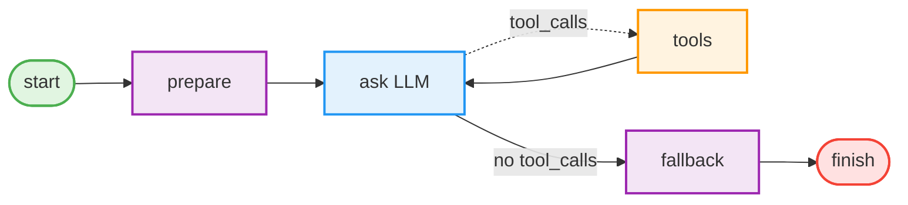
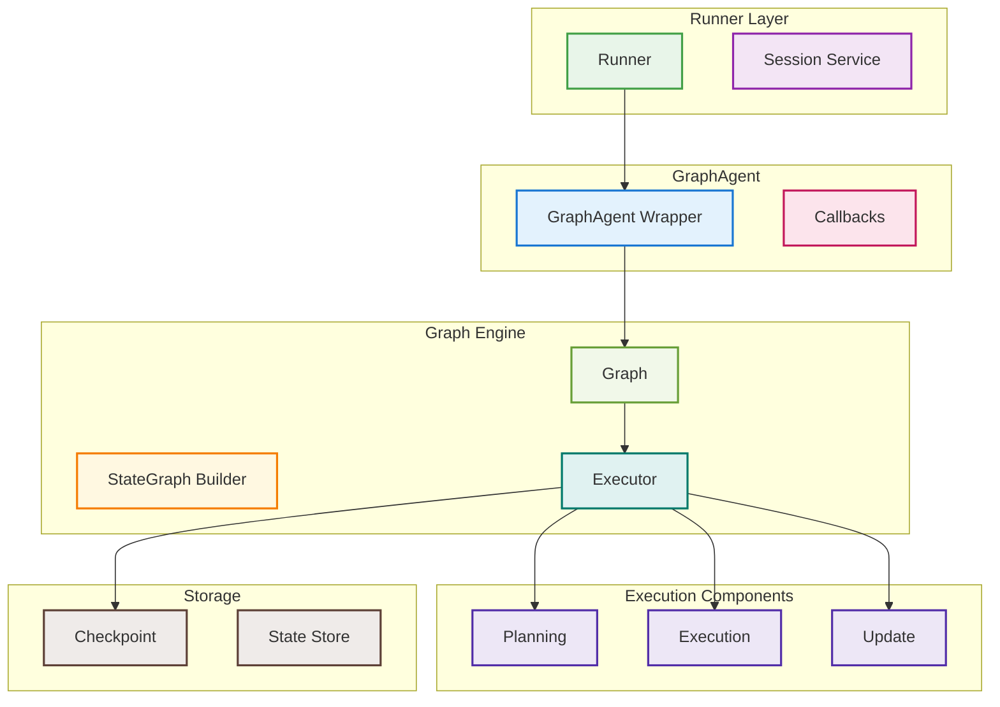
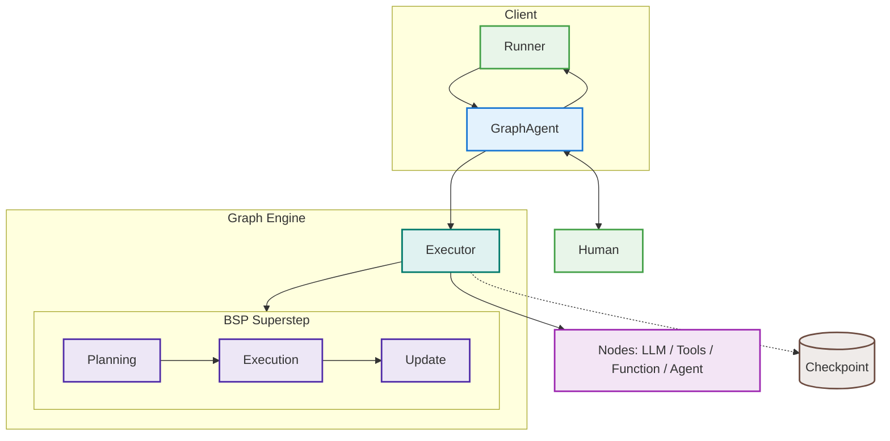
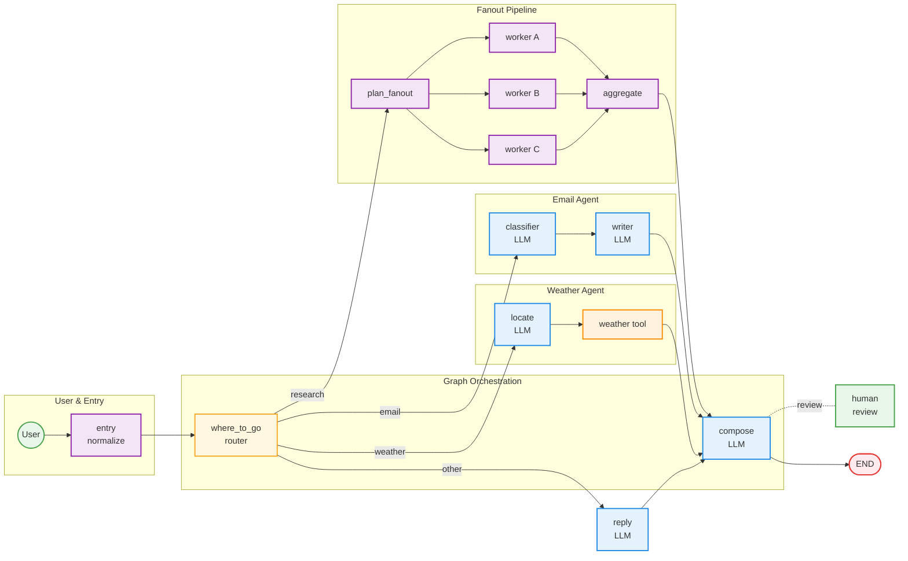

# Graph Package Guide

## Overview

Graph combines controllable workflow orchestration with extensible agent capabilities. It is suitable for:
- Type-safe state management and predictable routing.
- LLM decision making, tool-calling loops, and optional Human in the Loop (HITL).
- Reusable components that can run standalone or be composed as sub‑agents.

Highlights:
- Schema‑driven State and Reducers to avoid data races when concurrent branches write the same field.
- Deterministic parallelism with BSP style (Plan / Execute / Update).
- Built‑in node types wrap LLM, Tools, and Agent to reduce boilerplate.
- Streaming events, checkpoints, and interrupts for observability and recovery.
- Node‑level retry/backoff with exponential delay and jitter, plus executor‑level defaults and rich retry metadata in events.

## Quick Start

### Minimal Workflow

Below is a classic “prepare → ask LLM → optionally call tools” loop using `graph.MessagesStateSchema()` (predefines `graph.StateKeyMessages`, `graph.StateKeyUserInput`, `graph.StateKeyLastResponse`, etc.).



The Graph package allows you to model complex AI workflows as directed graphs, where nodes represent processing steps and edges represent data flow and control flow. It is particularly suitable for building AI applications that require conditional routing, state management, and multi-step processing.

### Usage Pattern

The usage of the Graph package follows this pattern:

1. **Create Graph**: Use `StateGraph` builder to define workflow structure
2. **Create GraphAgent**: Wrap the compiled Graph as an Agent
3. **Create Runner**: Use Runner to manage sessions and execution environment
4. **Execute Workflow**: Execute workflow through Runner and handle results

This pattern provides:

- **Type Safety**: Ensures data consistency through state schema
- **Session Management**: Supports concurrent execution for multiple users and sessions
- **Event Stream**: Real-time monitoring of workflow execution progress
- **Error Handling**: Unified error handling and recovery mechanisms

### Agent Integration

GraphAgent implements the `agent.Agent` interface and can:

- **Act as Independent Agent**: Execute directly through Runner
- **Act as SubAgent**: Be used as a sub-agent by other Agents (such as LLMAgent)
- **Host SubAgents**: Register child agents via `graphagent.WithSubAgents` and invoke them through `AddAgentNode`

This design lets GraphAgent plug into other agents while orchestrating its own specialized sub-agents.

### Key Features

- **Type-safe state management**: Use Schema to define state structure, support custom Reducers
- **Conditional routing**: Dynamically select execution paths based on state
- **LLM node integration**: Built-in support for large language models
- **Tool nodes**: Support function calls and external tool integration
- **Agent nodes**: Delegate parts of the workflow to registered sub-agents
- **Streaming execution**: Support real-time event streams and progress tracking
- **Concurrency safety**: Thread-safe graph execution
- **Checkpoint-based Time Travel**: Navigate through execution history and restore previous states
- **Human-in-the-Loop (HITL)**: Support for interactive workflows with interrupt and resume capabilities
- **Atomic checkpointing**: Atomic storage of checkpoints with pending writes for reliable recovery
- **Checkpoint Lineage**: Track related checkpoints forming execution threads with parent-child relationships

## Core Concepts

### 1. Graph

A graph is the core structure of a workflow, consisting of nodes and edges:

```go
import (
    "trpc.group/trpc-go/trpc-agent-go/graph"
)

// Create state schema.
schema := graph.NewStateSchema()

// Create graph.
graph := graph.New(schema)
```

**Virtual Nodes**:

- `Start`: Virtual start node, automatically connected through `SetEntryPoint()`
- `End`: Virtual end node, automatically connected through `SetFinishPoint()`
- These nodes don't need to be explicitly created, the system automatically handles connections

### 2. Node

A node represents a processing step in the workflow:

```go
import (
    "context"

    "trpc.group/trpc-go/trpc-agent-go/graph"
)

// Node function signature.
type NodeFunc func(ctx context.Context, state graph.State) (any, error)

// Create node.
node := &graph.Node{
    ID:          "process_data",
    Name:        "Data Processing",
    Description: "Process input data",
    Function:    processDataFunc,
}
```

### 3. State

State is a data container passed between nodes:

```go
import (
	"trpc.group/trpc-go/trpc-agent-go/graph"
)

// State is a key-value pair mapping.
type State map[string]any

// User-defined state keys.
const (
	StateKeyInput         = "input"          // Input data.
	StateKeyResult        = "result"         // Processing result.
	StateKeyProcessedData = "processed_data" // Processed data.
	StateKeyStatus        = "status"         // Processing status.
)
```

**Built-in State Keys**:

The Graph package provides some built-in state keys, mainly for internal system communication:

**User-accessible Built-in Keys**:

- `StateKeyUserInput`: User input (one-shot, cleared after consumption, persisted by LLM nodes)
- `StateKeyOneShotMessages`: One-shot messages (complete override for current round, cleared after consumption)
- `StateKeyLastResponse`: Last response (used to set final output, Executor reads this value as result)
- `StateKeyMessages`: Message history (durable, supports append + MessageOp patch operations)
- `StateKeyNodeResponses`: Per-node responses map. Key is node ID, value is the
  node's final textual response. Use `StateKeyLastResponse` for the final
  serial output; when multiple parallel nodes converge, read each node's
  output from `StateKeyNodeResponses`.
- `StateKeyMetadata`: Metadata (general metadata storage available to users)

**System Internal Keys** (users should not use directly):

- `StateKeySession`: Session information (automatically set by GraphAgent)
- `StateKeyExecContext`: Execution context (automatically set by Executor)
- `StateKeyToolCallbacks`: Tool callbacks (automatically set by Executor)
- `StateKeyModelCallbacks`: Model callbacks (automatically set by Executor)

Users should use custom state keys to store business data, and only use user-accessible built-in state keys when necessary.

### 4. State Schema

State schema defines the structure and behavior of state:

```go
import (
    "reflect"

    "trpc.group/trpc-go/trpc-agent-go/graph"
)

// Create state schema.
schema := graph.NewStateSchema()

// Add field definitions.
schema.AddField("counter", graph.StateField{
    Type:    reflect.TypeOf(0),
    Reducer: graph.DefaultReducer,
    Default: func() any { return 0 },
})
```

## Usage Guide

### Node I/O Conventions

Nodes communicate exclusively through the shared state. Each node returns a state delta which is merged into the graph state using the schema’s reducers. Downstream nodes read whatever upstream nodes wrote.

- Common built‑in keys (user‑facing)
  - `user_input`: One‑shot input for the next LLM/Agent node. Cleared after consumption.
  - `one_shot_messages`: Full message override for the next LLM call. Cleared after consumption.
  - `messages`: Durable conversation history (LLM/Tools append here). Supports MessageOp patches.
  - `last_response`: The last textual assistant response.
  - `node_responses`: Map[nodeID]any — per‑node final textual response. Use `last_response` for the most recent.

- Function node
  - Input: the entire state
  - Output: return a `graph.State` delta with custom keys (declare them in the schema), e.g. `{"parsed_time": "..."}`

- LLM node
  - Input priority: `one_shot_messages` → `user_input` → `messages`
  - Output:
    - Appends assistant message to `messages`
    - Sets `last_response`
    - Sets `node_responses[<llm_node_id>]`

- Tools node
  - Input: scans `messages` for the latest assistant message with `tool_calls`
  - Output: appends tool responses to `messages`

- Agent node (sub‑agent)
  - Input: state is injected into the sub‑agent’s `Invocation.RunOptions.RuntimeState`.
    - Model/Tool callbacks can access it via `agent.InvocationFromContext(ctx)`.
  - Output on finish:
    - Sets `last_response`
    - Sets `node_responses[<agent_node_id>]`
    - Clears `user_input`

Recommended patterns

- Add your own keys in the schema (e.g., `parsed_time`, `final_payload`) and write/read them in function nodes.
- To feed structured hints into an LLM node, write `one_shot_messages` in the previous node (e.g., prepend a system message with parsed context).
- To consume an upstream node’s text, read `last_response` immediately downstream or fetch from `node_responses[that_node_id]` later.

See examples:

- `examples/graph/io_conventions` — Function + LLM + Agent I/O
- `examples/graph/io_conventions_tools` — Adds a Tools node path and shows how to capture tool JSON
- `examples/graph/retry` — Node-level retry/backoff demonstration

#### Constant references (import and keys)

- Import: `import "trpc.group/trpc-go/trpc-agent-go/graph"`
- Defined in: `graph/state.go`

- User‑facing keys
  - `user_input` → `graph.StateKeyUserInput`
  - `one_shot_messages` → `graph.StateKeyOneShotMessages`
  - `messages` → `graph.StateKeyMessages`
  - `last_response` → `graph.StateKeyLastResponse`
  - `node_responses` → `graph.StateKeyNodeResponses`

- Other useful keys
  - `session` → `graph.StateKeySession`
  - `metadata` → `graph.StateKeyMetadata`
  - `current_node_id` → `graph.StateKeyCurrentNodeID`
  - `exec_context` → `graph.StateKeyExecContext`
  - `tool_callbacks` → `graph.StateKeyToolCallbacks`
  - `model_callbacks` → `graph.StateKeyModelCallbacks`
  - `agent_callbacks` → `graph.StateKeyAgentCallbacks`
  - `parent_agent` → `graph.StateKeyParentAgent`

Snippet:

```go
import (
    "context"
    "trpc.group/trpc-go/trpc-agent-go/graph"
)

func myNode(ctx context.Context, state graph.State) (any, error) {
    last, _ := state[graph.StateKeyLastResponse].(string)
    return graph.State{"my_key": last}, nil
}
```

#### Event metadata keys (StateDelta)

- Import: `import "trpc.group/trpc-go/trpc-agent-go/graph"`
- Defined in: `graph/events.go`

- Model metadata: `_model_metadata` → `graph.MetadataKeyModel` (struct `graph.ModelExecutionMetadata`)
- Tool metadata: `_tool_metadata` → `graph.MetadataKeyTool` (struct `graph.ToolExecutionMetadata`)
- Node metadata: `_node_metadata` → `graph.MetadataKeyNode` (struct `graph.NodeExecutionMetadata`). Includes retry info: `Attempt`, `MaxAttempts`, `NextDelay`, `Retrying` and timing fields.

Snippet:

```go
if b, ok := event.StateDelta[graph.MetadataKeyModel]; ok {
    var md graph.ModelExecutionMetadata
    _ = json.Unmarshal(b, &md)
}
```

### 1. Creating GraphAgent and Runner

Users mainly use the Graph package by creating GraphAgent and then using it through Runner. This is the recommended usage pattern:

```go
package main

import (
    "context"
    "fmt"
    "time"

    "trpc.group/trpc-go/trpc-agent-go/agent/graphagent"
    "trpc.group/trpc-go/trpc-agent-go/event"
    "trpc.group/trpc-go/trpc-agent-go/graph"
    "trpc.group/trpc-go/trpc-agent-go/model"
    "trpc.group/trpc-go/trpc-agent-go/runner"
    "trpc.group/trpc-go/trpc-agent-go/session/inmemory"
)

func main() {
    // 1. Create state schema.
    schema := graph.MessagesStateSchema()

    // 2. Create state graph builder.
    stateGraph := graph.NewStateGraph(schema)

    // 3. Add nodes.
    stateGraph.AddNode("start", startNodeFunc).
        AddNode("process", processNodeFunc)

    // 4. Set edges.
    stateGraph.AddEdge("start", "process")

    // 5. Set entry point and finish point.
    // SetEntryPoint automatically creates edge from virtual Start node to "start" node.
    // SetFinishPoint automatically creates edge from "process" node to virtual End node.
    stateGraph.SetEntryPoint("start").
        SetFinishPoint("process")

    // 6. Compile graph.
    compiledGraph, err := stateGraph.Compile()
    if err != nil {
        panic(err)
    }

    // 7. Create GraphAgent.
    graphAgent, err := graphagent.New("simple-workflow", compiledGraph,
        graphagent.WithDescription("Simple workflow example"),
        graphagent.WithInitialState(graph.State{}),
    )
    if err != nil {
        panic(err)
    }

    // 8. Create session service.
    sessionService := inmemory.NewSessionService()

    // 9. Create Runner.
    appRunner := runner.NewRunner(
        "simple-app",
        graphAgent,
        runner.WithSessionService(sessionService),
    )

    // 10. Execute workflow.
    ctx := context.Background()
    userID := "user"
    sessionID := fmt.Sprintf("session-%d", time.Now().Unix())

    // Create user message (Runner automatically puts message content into StateKeyUserInput).
    message := model.NewUserMessage("Hello World")

    // Execute through Runner.
    eventChan, err := appRunner.Run(ctx, userID, sessionID, message)
    if err != nil {
        panic(err)
    }

    // Handle event stream.
    for event := range eventChan {
        if event.Error != nil {
            fmt.Printf("Error: %s\n", event.Error.Message)
            continue
        }

        if len(event.Response.Choices) > 0 {
            choice := event.Response.Choices[0]
            if choice.Delta.Content != "" {
                fmt.Print(choice.Delta.Content)
            }
        }

        if event.Done {
            break
        }
    }
}

// Node function implementations.
func startNodeFunc(ctx context.Context, state graph.State) (any, error) {
    // Get user input from built-in StateKeyUserInput (automatically set by Runner).
    input := state[graph.StateKeyUserInput].(string)
    return graph.State{
        StateKeyProcessedData: fmt.Sprintf("Processed: %s", input),
    }, nil
}

func processNodeFunc(ctx context.Context, state graph.State) (any, error) {
    processed := state[StateKeyProcessedData].(string)
    result := fmt.Sprintf("Result: %s", processed)
    return graph.State{
        StateKeyResult: result,
        // Use built-in StateKeyLastResponse to set final output.
        graph.StateKeyLastResponse: fmt.Sprintf("Final result: %s", result),
    }, nil
}
```

### 2. Using LLM Nodes

LLM nodes implement a fixed three-stage input rule without extra configuration:

1. OneShot first: If `one_shot_messages` exists, use it as the input for this round.
2. UserInput next: Otherwise, if `user_input` exists, persist once to history.
3. History default: Otherwise, use durable `messages` as input.

```go
// Create LLM model.
model := openai.New("gpt-4")

// Add LLM node.
stateGraph.AddLLMNode("analyze", model,
    `You are a document analysis expert. Analyze the provided document and:
1. Classify document type and complexity
2. Extract key themes
3. Evaluate content quality
Please provide structured analysis results.`,
    nil) // Tool mapping.
```

Important notes:

- System prompt is only used for this round and is not persisted to state.
- One-shot keys (`user_input` / `one_shot_messages`) are automatically cleared after successful execution.
- All state updates are atomic.
- GraphAgent/Runner only sets `user_input` and no longer pre-populates `messages` with a user message. This allows any pre-LLM node to modify `user_input` and have it take effect in the same round.

#### Three input paradigms

- OneShot (`StateKeyOneShotMessages`):

  - When present, only the provided `[]model.Message` is used for this round, typically including a full system prompt and user prompt. Automatically cleared afterwards.
  - Use case: a dedicated pre-node constructs the full prompt and must fully override input.

- UserInput (`StateKeyUserInput`):

  - When non-empty, the LLM node uses durable `messages` plus this round's user input to call the model. After the call, it writes the user input and assistant reply to `messages` using `MessageOp` (e.g., `AppendMessages`, `ReplaceLastUser`) atomically, and clears `user_input` to avoid repeated appends.
  - Use case: conversational flows where pre-nodes may adjust user input.

- Messages only (just `StateKeyMessages`):
  - Common in tool-call loops. After the first round via `user_input`, routing to tools and back to LLM, since `user_input` is cleared, the LLM uses only `messages` (history). The tail is often a `tool` response, enabling the model to continue reasoning based on tool outputs.

#### Atomic updates with Reducer and MessageOp

The Graph package supports `MessageOp` patch operations (e.g., `ReplaceLastUser`,
`AppendMessages`) on message state via `MessageReducer` to achieve atomic merges. Benefits:

- Pre-LLM nodes can modify `user_input`. The LLM node returns a single state delta with the needed patch operations (replace last user message, append assistant message) for one-shot, race-free persistence.
- Backwards compatible with appending `[]Message`, while providing more expressive updates for complex cases.

Example: modify `user_input` in a pre-node before entering the LLM node.

```go
stateGraph.
    AddNode("prepare_input", func(ctx context.Context, s graph.State) (any, error) {
        cleaned := strings.TrimSpace(s[graph.StateKeyUserInput].(string))
        return graph.State{graph.StateKeyUserInput: cleaned}, nil
    }).
    AddLLMNode("ask", modelInstance,
        "You are a helpful assistant. Answer concisely.",
        nil).
    SetEntryPoint("prepare_input").
    SetFinishPoint("ask")
```

### 3. GraphAgent Configuration Options

GraphAgent supports various configuration options:

```go
// Multiple options can be used when creating GraphAgent.
graphAgent, err := graphagent.New(
    "workflow-name",
    compiledGraph,
    graphagent.WithDescription("Workflow description"),
    graphagent.WithInitialState(graph.State{
        "initial_data": "Initial data",
    }),
    graphagent.WithChannelBufferSize(1024),            // Tune event buffer size
    graphagent.WithCheckpointSaver(memorySaver),       // Persist checkpoints if needed
    graphagent.WithSubAgents([]agent.Agent{subAgent}), // Register sub-agents by name
    graphagent.WithAgentCallbacks(&agent.Callbacks{
        // Agent-level callbacks.
    }),
)
```

> Model/tool callbacks are configured per node, e.g. `AddLLMNode(..., graph.WithModelCallbacks(...))`
> or `AddToolsNode(..., graph.WithToolCallbacks(...))`.

Once sub-agents are registered you can delegate within the graph via agent nodes:

```go
// Assume subAgent.Info().Name == "assistant"
stateGraph.AddAgentNode("assistant",
    graph.WithName("Delegate to assistant agent"),
    graph.WithDescription("Invoke the pre-registered assistant agent"),
)

// During execution the GraphAgent looks up a sub-agent with the same name and runs it
```

> The agent node uses its ID for the lookup, so keep `AddAgentNode("assistant")`
> aligned with `subAgent.Info().Name == "assistant"`.

### 4. Conditional Routing

```go
// Define condition function.
func complexityCondition(ctx context.Context, state graph.State) (string, error) {
    complexity := state["complexity"].(string)
    if complexity == "simple" {
        return "simple_process", nil
    }
    return "complex_process", nil
}

// Add conditional edges.
stateGraph.AddConditionalEdges("analyze", complexityCondition, map[string]string{
    "simple_process":  "simple_node",
    "complex_process": "complex_node",
})
```

### 5. Tool Node Integration

```go
// Create tools.
tools := map[string]tool.Tool{
    "calculator": calculatorTool,
    "search":     searchTool,
}

// Add tool node.
stateGraph.AddToolsNode("tools", tools)

// Add conditional routing from LLM to tools.
stateGraph.AddToolsConditionalEdges("llm_node", "tools", "fallback_node")
```

Tool-call pairing and second entry into LLM:

- Scan `messages` backward from the tail to find the most recent `assistant(tool_calls)`; stop at `user` to ensure correct pairing.
- When returning from tools to the LLM node, since `user_input` is cleared, the LLM follows the “Messages only” branch and continues based on the tool response in history.

#### Placeholder Variables in LLM Instructions

LLM nodes support placeholder injection in their `instruction` string (same rules as LLMAgent):

- `{key}` → replaced by `session.State["key"]`
- `{key?}` → optional; missing values become empty
- `{user:subkey}`, `{app:subkey}`, `{temp:subkey}` → access user/app/temp scopes (session services merge app/user state into session with these prefixes)

Notes:

- GraphAgent writes the current `*session.Session` into graph state under `StateKeySession`; the LLM node reads values from there
- Unprefixed keys (e.g., `research_topics`) must be present directly in `session.State`

Example:

```go
mdl := openai.New(modelName)
stateGraph.AddLLMNode(
  "research",
  mdl,
  "You are a research assistant. Focus: {research_topics}. User: {user:topics?}. App: {app:banner?}.",
  nil,
)
```

See the runnable example: `examples/graph/placeholder`.

### 6. Node Retry & Backoff

Configure per‑node retry with exponential backoff and optional jitter. Failed attempts do not produce writes; only a successful attempt applies its state delta and routing.

- Per‑node policy via `WithRetryPolicy`:

```go
// Simple convenience policy (attempts include the first try)
sg.AddNode("unstable", unstableFunc,
    graph.WithRetryPolicy(graph.WithSimpleRetry(3)))

// Full policy
policy := graph.RetryPolicy{
    MaxAttempts:     3,                      // 1 initial + up to 2 retries
    InitialInterval: 200 * time.Millisecond, // base delay
    BackoffFactor:   2.0,                    // exponential backoff
    MaxInterval:     2 * time.Second,        // clamp
    Jitter:          true,                   // randomize delay
    RetryOn: []graph.RetryCondition{
        graph.DefaultTransientCondition(),   // deadline/net timeouts
        graph.RetryOnErrors(context.DeadlineExceeded),
        graph.RetryOnPredicate(func(err error) bool { return true }),
    },
    MaxElapsedTime:  5 * time.Second,        // total retry budget (optional)
    // PerAttemptTimeout: 0,                 // reserved; node timeout comes from executor
}
sg.AddNode("unstable", unstableFunc, graph.WithRetryPolicy(policy))
```

- Default policy via Executor (applies when a node has none):

```go
exec, _ := graph.NewExecutor(compiled,
    graph.WithDefaultRetryPolicy(graph.WithSimpleRetry(2)))
```

Notes
- Interrupts are never retried.
- Backoff delay is clamped by the current step deadline when set (`WithStepTimeout`).
- Events carry retry metadata so UIs/CLIs can display progress:

```go
if b, ok := ev.StateDelta[graph.MetadataKeyNode]; ok {
    var md graph.NodeExecutionMetadata
    _ = json.Unmarshal(b, &md)
    if md.Phase == graph.ExecutionPhaseError && md.Retrying {
        // md.Attempt, md.MaxAttempts, md.NextDelay
    }
}
```

Example: `examples/graph/retry` shows an unstable node that retries before a final LLM answer.

### 7. Runner Configuration

Runner provides session management and execution environment:

```go
// Create session service.
sessionService := inmemory.NewSessionService()
// Or use Redis session service.
// sessionService, err := redis.NewService(redis.WithRedisClientURL("redis://localhost:6379"))

// Create Runner.
appRunner := runner.NewRunner(
    "app-name",
    graphAgent,
    runner.WithSessionService(sessionService),
    // Can add more configuration options.
)

// Use Runner to execute workflow.
// Runner only sets StateKeyUserInput; it no longer pre-populates StateKeyMessages.
message := model.NewUserMessage("User input")
eventChan, err := appRunner.Run(ctx, userID, sessionID, message)
```

### 8. Message State Schema

For conversational applications, you can use predefined message state schema:

```go
// Use message state schema.
schema := graph.MessagesStateSchema()

// This schema includes:
// - messages: Conversation history (StateKeyMessages).
// - user_input: User input (StateKeyUserInput).
// - last_response: Last response (StateKeyLastResponse).
// - node_responses: Map of nodeID -> response (StateKeyNodeResponses).
// - metadata: Metadata (StateKeyMetadata).
```

### 9. State Key Usage Scenarios

**User-defined State Keys**: Used to store business logic data.

```go
import (
    "trpc.group/trpc-go/trpc-agent-go/graph"
)

// Recommended: Use custom state keys.
const (
    StateKeyDocumentLength = "document_length"
    StateKeyComplexityLevel = "complexity_level"
    StateKeyProcessingStage = "processing_stage"
)

// Use in nodes.
return graph.State{
    StateKeyDocumentLength: len(input),
    StateKeyComplexityLevel: "simple",
    StateKeyProcessingStage: "completed",
}, nil
```

**Built-in State Keys**: Used for system integration.

```go
import (
    "time"

    "trpc.group/trpc-go/trpc-agent-go/graph"
)

// Get user input (automatically set by system).
userInput := state[graph.StateKeyUserInput].(string)

// Set final output (system will read this value).
return graph.State{
    graph.StateKeyLastResponse: "Processing complete",
}, nil

// Read per-node responses when multiple nodes (e.g., parallel LLM nodes)
// produce outputs. Values are stored as a map[nodeID]any and merged across
// steps. Use LastResponse for the final serial output; use NodeResponses for
// converged parallel outputs.
responses, _ := state[graph.StateKeyNodeResponses].(map[string]any)
news := responses["news"].(string)
dialog := responses["dialog"].(string)

// Use them separately or combine into the final output.
return graph.State{
    "news_output":  news,
    "dialog_output": dialog,
    graph.StateKeyLastResponse: news + "\n" + dialog,
}, nil

// Store metadata.
return graph.State{
    graph.StateKeyMetadata: map[string]any{
        "timestamp": time.Now(),
        "version": "1.0",
    },
}, nil
```

## Advanced Features

### 1. Interrupt and Resume (Human-in-the-Loop)

The Graph package supports human-in-the-loop (HITL) workflows through interrupt and resume functionality. This enables workflows to pause execution, wait for human input or approval, and then resume from the exact point where they were interrupted.

#### Basic Usage

```go
import (
    "context"
    "trpc.group/trpc-go/trpc-agent-go/graph"
)

// Create a node that can interrupt execution for human input
b.AddNode("approval_node", func(ctx context.Context, s graph.State) (any, error) {
    // Use the Interrupt helper for clean interrupt/resume handling
    prompt := map[string]any{
        "message": "Please approve this action (yes/no):",
        "data":    s["some_data"],
    }
 

Turn the diagram into a runnable workflow:

```go
package main

import (
    "context"
    "fmt"
    "strings"

    "trpc.group/trpc-go/trpc-agent-go/agent/graphagent"
    "trpc.group/trpc-go/trpc-agent-go/graph"
    "trpc.group/trpc-go/trpc-agent-go/model"
    "trpc.group/trpc-go/trpc-agent-go/model/openai"
    "trpc.group/trpc-go/trpc-agent-go/runner"
    "trpc.group/trpc-go/trpc-agent-go/tool"
    "trpc.group/trpc-go/trpc-agent-go/tool/function"
)

// Unexported constants to avoid magic strings
const (
    nodePrepare  = "prepare"
    nodeAsk      = "ask"
    nodeTools    = "tools"
    nodeFallback = "fallback"
    nodeFinish   = "finish"

    modelName     = "gpt-4o-mini"
    systemPrompt  = "You are a careful assistant."
    outputKeyFinal = "final_output"

    toolNameCalculator = "calculator"

    demoUserID    = "user"
    demoSessionID = "session"
    demoQuestion  = "What is 6 * 7?"
)

func newCalculator() tool.Tool {
    type Input struct {
        Expression string `json:"expression"`
    }
    type Output struct {
        Result float64 `json:"result"`
    }
    return function.NewFunctionTool[Input, Output](
        func(ctx context.Context, in Input) (Output, error) {
            // Implement a real evaluator here
            return Output{Result: 42}, nil
        },
        function.WithName(toolNameCalculator),
        function.WithDescription("Evaluate a math expression"),
    )
}

func buildWorkflow(m model.Model, tools map[string]tool.Tool) (*graph.Graph, error) {
    sg := graph.NewStateGraph(graph.MessagesStateSchema())

    sg.AddNode(nodePrepare, func(ctx context.Context, s graph.State) (any, error) {
        raw := fmt.Sprint(s[graph.StateKeyUserInput])
        cleaned := strings.TrimSpace(raw)
        return graph.State{graph.StateKeyUserInput: cleaned}, nil
    })

    sg.AddLLMNode(nodeAsk, m, systemPrompt, tools)
    sg.AddToolsNode(nodeTools, tools)

    sg.AddNode(nodeFallback, func(ctx context.Context, s graph.State) (any, error) {
        return graph.State{graph.StateKeyLastResponse: "No tools required; answer directly"}, nil
    })

    sg.AddNode(nodeFinish, func(ctx context.Context, s graph.State) (any, error) {
        return graph.State{outputKeyFinal: fmt.Sprint(s[graph.StateKeyLastResponse])}, nil
    })

    sg.SetEntryPoint(nodePrepare)
    sg.AddEdge(nodePrepare, nodeAsk)
    sg.AddToolsConditionalEdges(nodeAsk, nodeTools, nodeFallback)
    sg.AddEdge(nodeTools, nodeAsk)
    sg.AddEdge(nodeFallback, nodeFinish)
    sg.SetFinishPoint(nodeFinish)

    return sg.Compile()
}

func main() {
    mdl := openai.New(modelName)
    tools := map[string]tool.Tool{toolNameCalculator: newCalculator()}

    g, err := buildWorkflow(mdl, tools)
    if err != nil {
        panic(err)
    }

    // Run with GraphAgent + Runner (no direct Executor.Execute)
    ga, err := graphagent.New("demo", g)
    if err != nil {
        panic(err)
    }
    app := runner.NewRunner("app", ga)
    events, err := app.Run(context.Background(), demoUserID, demoSessionID,
        model.NewUserMessage(demoQuestion))
    if err != nil {
        panic(err)
    }
    for ev := range events {
        if ev.Response == nil {
            continue
        }
        if ev.Author == nodeAsk && !ev.Response.IsPartial && len(ev.Response.Choices) > 0 {
            fmt.Println("LLM:", ev.Response.Choices[0].Message.Content)
        }
        }
    }
}
```

The example shows how to declare nodes, connect edges, and run. Next, we’ll cover execution with GraphAgent + Runner, then core concepts and common practices.

### Execution

- Wrap the compiled graph with `graphagent.New` (as a generic `agent.Agent`) and hand it to `runner.Runner` to manage sessions and streaming events.

Minimal GraphAgent + Runner:

```go
compiled, _ := buildWorkflow(openai.New("gpt-4o-mini"), nil)
ga, _ := graphagent.New("demo", compiled)
app := runner.NewRunner("app", ga)

events, _ := app.Run(ctx, "user", "session", model.NewUserMessage("hi"))
for ev := range events { /* handle events */ }
```

Session backends:
- In-memory: `session/inmemory` (used by examples)
- Redis: `session/redis` (more common in production)

```go
import (
    "trpc.group/trpc-go/trpc-agent-go/session/redis"
)

sess, _ := redis.NewService(redis.WithRedisClientURL("redis://localhost:6379"))
app := runner.NewRunner("app", ga, runner.WithSessionService(sess))
```

### GraphAgent Options

```go
ga, err := graphagent.New(
    "workflow",
    compiledGraph,
    graphagent.WithDescription("Workflow description"),
    graphagent.WithInitialState(graph.State{"init": 1}),
    graphagent.WithChannelBufferSize(512),
    graphagent.WithCheckpointSaver(saver),
    graphagent.WithSubAgents([]agent.Agent{subAgent}),
    graphagent.WithAgentCallbacks(agent.NewCallbacks()),
)
```

## Core Concepts


### State Management

GraphAgent uses a Schema + Reducer model to manage state. You first define the state shape and merge rules; later nodes have clear expectations about the origin and lifecycle of keys they read/write.

#### Built‑in Schema

```go
import (
    "trpc.group/trpc-go/trpc-agent-go/graph"
)

schema := graph.MessagesStateSchema()

// Predefined fields (key constants) and semantics:
// - graph.StateKeyMessages       ("messages")        Conversation history ([]model.Message; MessageReducer + MessageOp for atomic updates)
// - graph.StateKeyUserInput      ("user_input")      User input (string; one-shot; cleared after successful execution)
// - graph.StateKeyLastResponse   ("last_response")   Last response (string)
// - graph.StateKeyNodeResponses  ("node_responses")  Per-node outputs (map[string]any; aggregated across parallel branches)
// - graph.StateKeyMetadata       ("metadata")        Metadata (map[string]any; merged by MergeReducer)

// Additional one-shot/system keys (use as needed):
// - graph.StateKeyOneShotMessages ("one_shot_messages")  One-shot override of this turn's input ([]model.Message)
// - graph.StateKeySession         ("session")            Session object (internal)
// - graph.StateKeyExecContext     ("exec_context")       Execution context (events etc., internal)
```

#### Custom Schema

```go
import (
    "reflect"
    "trpc.group/trpc-go/trpc-agent-go/graph"
)

schema := graph.NewStateSchema()

// Add a custom field
schema.AddField("counter", graph.StateField{
    Type:    reflect.TypeOf(0),
    Default: func() any { return 0 },
    Reducer: func(old, new any) any {
        return old.(int) + new.(int)  // accumulate
    },
})

// String slice with a built-in reducer
schema.AddField("items", graph.StateField{
    Type:    reflect.TypeOf([]string{}),
    Default: func() any { return []string{} },
    Reducer: graph.StringSliceReducer,
})
```

Reducers ensure fields are merged safely per predefined rules, which is critical under concurrent execution.

Tip: define constants for business keys to avoid scattered magic strings.

### Node Types

GraphAgent provides four built‑in node types:

#### Function Node
The most basic node, for custom logic:

```go
import (
    "context"

    "trpc.group/trpc-go/trpc-agent-go/graph"
)

const (
    stateKeyInput  = "input"
    stateKeyOutput = "output"
    nodeProcess    = "process"
)

sg.AddNode(nodeProcess, func(ctx context.Context, state graph.State) (any, error) {
    data := state[stateKeyInput].(string)
    processed := transform(data)
    // Function nodes must explicitly specify the output key
    return graph.State{stateKeyOutput: processed}, nil
})
```

#### LLM Node
Integrates an LLM and auto‑manages conversation history:

```go
import (
    "trpc.group/trpc-go/trpc-agent-go/graph"
    "trpc.group/trpc-go/trpc-agent-go/model/openai"
)

const (
    llmModelName     = "gpt-4o-mini"
    llmSystemPrompt  = "System prompt"
    llmNodeAssistant = "assistant"
)

model := openai.New(llmModelName)
sg.AddLLMNode(llmNodeAssistant, model, llmSystemPrompt, tools)

// Inputs (priority): graph.StateKeyOneShotMessages > graph.StateKeyUserInput > graph.StateKeyMessages
// Outputs: graph.StateKeyLastResponse, graph.StateKeyMessages (atomic), graph.StateKeyNodeResponses (includes this node's output for aggregation)
```

#### Tools Node
Executes tool calls in sequence:

```go
import (
    "trpc.group/trpc-go/trpc-agent-go/graph"
)

const nodeTools = "tools"

sg.AddToolsNode(nodeTools, tools)
// Multiple tools execute in the order returned by the LLM
// For parallelism, use multiple nodes + parallel edges
// Pairing rule: walk the messages from the tail to the most recent assistant(tool_calls)
// message; stop at a new user to ensure pairing with the current tool call round.
```

#### Reading Tool Results into State

After a tools node, add a function node to collect tool outputs from `graph.StateKeyMessages` and write a structured result into state:

```go
const stateKeyToolResults = "tool_results"

sg.AddNode("collect_tool_results", func(ctx context.Context, s graph.State) (any, error) {
    msgs, _ := s[graph.StateKeyMessages].([]model.Message)
    if len(msgs) == 0 { return nil, nil }

    // Find latest assistant(tool_calls) for this round
    i := len(msgs) - 1
    for i >= 0 && !(msgs[i].Role == model.RoleAssistant && len(msgs[i].ToolCalls) > 0) {
        if msgs[i].Role == model.RoleUser { // crossed a new round
            return nil, nil
        }
        i--
    }
    if i < 0 { return nil, nil }

    // Collect matching tool results (by ToolID)
    idset := map[string]bool{}
    for _, tc := range msgs[i].ToolCalls { idset[tc.ID] = true }
    results := map[string]string{}
    for j := i + 1; j < len(msgs); j++ {
        m := msgs[j]
        if m.Role == model.RoleTool && idset[m.ToolID] {
            // Each tool decided its own output encoding; here treat content as JSON/text
            results[m.ToolName] = m.Content
        }
        if m.Role == model.RoleUser { break }
    }
    if len(results) == 0 { return nil, nil }
    return graph.State{stateKeyToolResults: results}, nil
})
```

Reference example: `examples/graph/io_conventions_tools`.
```

#### Agent Node
Embed a sub‑agent to enable multi‑agent collaboration:

```go
import (
    "trpc.group/trpc-go/trpc-agent-go/agent"
    "trpc.group/trpc-go/trpc-agent-go/agent/graphagent"
)

const (
    subAgentNameAnalyzer = "analyzer"
    graphAgentNameMain   = "main"
)

// Important: node ID must match the sub‑agent's name
sg.AddAgentNode(subAgentNameAnalyzer)

// Inject sub‑agent instances when creating the GraphAgent
analyzer := createAnalyzer()  // internal agent name must be "analyzer"
graphAgent, _ := graphagent.New(graphAgentNameMain, g,
    graphagent.WithSubAgents([]agent.Agent{analyzer}))
```

### Edges and Routing

Edges define control flow between nodes:

```go
import (
    "context"

    "trpc.group/trpc-go/trpc-agent-go/graph"
)

const (
    nodeA         = "nodeA"
    nodeB         = "nodeB"
    nodeDecision  = "decision"
    nodePathA     = "pathA"
    nodePathB     = "pathB"

    routeToPathA  = "route_to_pathA"
    routeToPathB  = "route_to_pathB"
    stateKeyFlag  = "flag"
)

// Straight edge
sg.AddEdge(nodeA, nodeB)

// Conditional edges (third arg is the route map; provide explicitly for static checks)
// Define target nodes first
sg.AddNode(nodePathA, handlerA)
sg.AddNode(nodePathB, handlerB)
// Then add conditional routing
sg.AddConditionalEdges(nodeDecision, 
    func(ctx context.Context, s graph.State) (string, error) {
        if s[stateKeyFlag].(bool) {
            return routeToPathA, nil
        }
        return routeToPathB, nil
    }, map[string]string{
        routeToPathA: nodePathA,
        routeToPathB: nodePathB,
    })

// Tools conditional edges: handle LLM tool calls
const (
    nodeLLM      = "llm"
    nodeToolsUse = "tools"
    nodeFallback = "fallback"
)
sg.AddToolsConditionalEdges(nodeLLM, nodeToolsUse, nodeFallback)

// Parallel edges: branches from the same node run in parallel
const (
    nodeSplit   = "split"
    nodeBranch1 = "branch1"
    nodeBranch2 = "branch2"
)
sg.AddEdge(nodeSplit, nodeBranch1)
sg.AddEdge(nodeSplit, nodeBranch2)  // branch1 and branch2 execute in parallel
```

Tip: setting entry and finish points implicitly connects to virtual Start/End nodes:
- `SetEntryPoint("first")` is equivalent to Start → first.
- `SetFinishPoint("last")` is equivalent to last → End.
There’s no need to add these two edges explicitly.

Constants: `graph.Start == "__start__"`, `graph.End == "__end__"`.

### Command Mode (Dynamic Routing / Fan‑out)

Nodes can return `graph.State`, or `*graph.Command` / `[]*graph.Command` to update state and direct the next hop:

```go
// Dynamic route to A or B with a state write
const (
    nodeDecide = "decide"
    nodeA      = "A"
    nodeB      = "B"
    stateKeyFlag = "flag"
)

sg.AddNode(nodeDecide, func(ctx context.Context, s graph.State) (any, error) {
    if s[stateKeyFlag].(bool) {
        return &graph.Command{Update: graph.State{"routed": nodeA}, GoTo: nodeA}, nil
    }
    return &graph.Command{Update: graph.State{"routed": nodeB}, GoTo: nodeB}, nil
})

// Fan-out: dispatch multiple tasks to the same worker in parallel
const (
    nodeFanout = "fanout"
    nodeWorker = "worker"
)
sg.AddNode(nodeFanout, func(ctx context.Context, s graph.State) (any, error) {
    cmds := []*graph.Command{
        {Update: graph.State{"param": "A"}, GoTo: nodeWorker},
        {Update: graph.State{"param": "B"}, GoTo: nodeWorker},
        {Update: graph.State{"param": "C"}, GoTo: nodeWorker},
    }
    return cmds, nil
})
```

When using command‑based routing, you don’t need static edges to `GoTo` targets; just ensure the target nodes exist and call `SetFinishPoint` where appropriate.

## Architecture

### Overall Architecture

GraphAgent’s architecture manages complexity via clear layering. Each layer has a well‑defined responsibility and communicates through standard interfaces.



### Core Modules

Overview of core components:

`graph/state_graph.go` — StateGraph builder  
Provides a fluent, declarative Go API to build graphs via method chaining (AddNode → AddEdge → Compile) covering nodes, edges, and conditional routing.

`graph/graph.go` — Compiled runtime  
Implements channel‑based, event‑triggered execution. Node results merge into State; channels are used to drive routing and carry sentinel values (not business data).

`graph/executor.go` — BSP executor  
Heart of the system, inspired by Google’s Pregel. Implements BSP (Bulk Synchronous Parallel) supersteps: Planning → Execution → Update.

`graph/checkpoint/*` — Checkpoints and recovery  
Optional checkpoint persistence (e.g., sqlite). Atomically saves state and pending writes; supports lineage/checkpoint‑based recovery.

`agent/graphagent/graph_agent.go` — Bridge between Graph and Agent  
Adapts a compiled Graph into a generic Agent, reusing sessions, callbacks, and streaming.

### Execution Model

GraphAgent adapts Pregel’s BSP (Bulk Synchronous Parallel) to a single‑process runtime and adds checkpoints, HITL interrupts/resumes, and time travel:

```mermaid
sequenceDiagram
    autonumber
    participant R as Runner
    participant GA as GraphAgent
    participant EX as Executor
    participant CK as Checkpoint Saver
    participant DB as Storage
    participant H as Human

    R->>GA: Run(invocation)
    GA->>EX: Execute(graph, state, options)
    GA-->>R: Stream node/tool/model events

    loop Each superstep (BSP)
        EX->>EX: Planning — compute frontier
        par Parallel node execution
            EX->>EX: Run node i (shallow state copy)
            EX-->>GA: node-start event (author=nodeID)
        and
            EX->>EX: Run node j (shallow state copy)
            EX-->>GA: node-start event
        end

        alt Node triggers Interrupt(key,prompt)
            EX->>CK: Save checkpoint(state,frontier,
            EX->>CK: pending_writes,versions_seen,reason=interrupt)
            CK->>DB: atomic commit
            EX-->>GA: interrupt event(checkpoint_id,prompt)
            GA-->>R: propagate + pause
            R->>H: ask for input/approval
            H-->>R: provide decision/value
            R->>GA: Run(resume) runtime_state{
            R->>GA: checkpoint_id,resume_map}
            GA->>EX: ResumeFromCheckpoint(checkpoint_id,resume_map)
            EX->>CK: Load checkpoint
            CK->>EX: state/frontier/pending_writes/versions_seen
            EX->>EX: rebuild frontier and apply resume values
        else Normal
            EX-->>GA: node-complete events (incl. tool/model)
            EX->>EX: Update — merge via reducers
            EX->>CK: Save checkpoint(state,frontier,
            EX->>CK: pending_writes,versions_seen)
            CK->>DB: atomic commit
        end
    end

    Note over EX,CK: versions_seen prevents re-execution
    Note over EX,CK: pending_writes rebuilds channels
    Note over EX,CK: parent_id forms lineage for time travel

    opt Time travel (rewind/branch)
        R->>GA: Run(runtime_state{checkpoint_id})
        GA->>EX: ResumeFromCheckpoint(checkpoint_id)
        EX->>CK: Load checkpoint + lineage
        CK->>EX: Restore state; may create new lineage_id
    end

    EX-->>GA: done event (last_response)
    GA-->>R: final output
```



Key points:

1. Planning: determine runnable nodes from the channel frontier.
2. Execution: each node gets a shallow state copy (maps.Copy) and runs in parallel.
3. Update: reducers merge updates safely for concurrency.

This design enables per‑step observability and safe interruption/recovery.

#### Runtime Isolation and Event Snapshots

- The Executor is reusable and concurrency‑safe. Per‑run state lives in `ExecutionContext` (channel versions, pending writes, last checkpoint, etc.).
- Each event’s `StateDelta` is a deep‑copy snapshot containing only serializable and allowed keys; internal keys (execution context, callbacks, etc.) are filtered out for external telemetry and persistence.

### Executor Configuration

```go
exec, err := graph.NewExecutor(g,
    graph.WithChannelBufferSize(1024),              // event channel buffer
    graph.WithMaxSteps(50),                          // max steps
    graph.WithStepTimeout(5*time.Minute),            // step timeout
    graph.WithNodeTimeout(2*time.Minute),            // node timeout
    graph.WithCheckpointSaver(saver),                // enable checkpoints (sqlite/inmemory)
    graph.WithCheckpointSaveTimeout(30*time.Second), // checkpoint save timeout
)
```

### Defaults and Notes

- Defaults (Executor)
  - `ChannelBufferSize = 256`, `MaxSteps = 100`, `CheckpointSaveTimeout = 10s`
  - Per‑step/node timeouts are available on `Executor` via `WithStepTimeout` / `WithNodeTimeout` (not exposed by `GraphAgent` options yet)

- Sessions
  - Prefer Redis session backend in production; set TTLs and cleanup
- Runner seeds multi‑turn `graph.StateKeyMessages` from session events automatically

- Checkpoints
  - Use stable `namespace` names (e.g., `svc:prod:flowX`); audit and clean up by lineage via `CheckpointManager`

- Events/backpressure
  - Tune `WithChannelBufferSize`; filter events by `author`/`object` to reduce noise

- Naming and keys
  - Use constants for node IDs, route labels, and state keys; define reducers for non‑trivial merges

- Governance
- Insert HITL on critical paths; prefer storing sensitive details under `graph.StateKeyMetadata` rather than `graph.StateKeyMessages`

## Integrating with Multi‑Agent Systems

GraphAgent is designed to be part of the tRPC‑Agent‑Go multi‑agent ecosystem, not an island. It implements the standard Agent interface and collaborates with other agent types.

### GraphAgent as an Agent

GraphAgent implements the standard Agent interface:

```go
import (
    "trpc.group/trpc-go/trpc-agent-go/agent"
    "trpc.group/trpc-go/trpc-agent-go/agent/chainagent"
)

// Use directly inside ChainAgent, ParallelAgent, CycleAgent
chain := chainagent.New("chain",
    chainagent.WithSubAgents([]agent.Agent{
        graphAgent1,  // structured flow #1
        graphAgent2,  // structured flow #2
    }))
```

### Advanced Orchestration

End‑to‑end business flow: entry normalization → smart routing → multiple pods (Email, Weather, Research) → parallel fan‑out/aggregation → final composition and publish.



Highlights:
- `where_to_go` can be LLM‑decided or function‑driven (conditional edges).
- Fanout Pipeline uses Command GoTo at runtime, then aggregates.
- Optional human review follows aggregation to gate critical output.
- Single checkpoint display at Compose balances clarity and recoverability.

### Embedding Agents in a Graph

Inside a graph, you can call existing sub‑agents as nodes. The example below shows how to create sub‑agents, declare the corresponding nodes, and inject them when constructing the GraphAgent.

```go
import (
    "trpc.group/trpc-go/trpc-agent-go/agent"
    "trpc.group/trpc-go/trpc-agent-go/agent/graphagent"
)

// Create sub‑agents
const (
    SubAgentAnalyzer = "analyzer"
    SubAgentReviewer = "reviewer"
)
analyzer := createAnalyzer()  // name must be "analyzer"
reviewer := createReviewer()  // name must be "reviewer"

// Declare agent nodes in the graph
sg.AddAgentNode(SubAgentAnalyzer)
sg.AddAgentNode(SubAgentReviewer)

// Inject sub‑agents when creating the GraphAgent
graphAgent, _ := graphagent.New("workflow", g,
    graphagent.WithSubAgents([]agent.Agent{
        analyzer,
        reviewer,
    }))

// I/O: sub‑agents receive graph.StateKeyUserInput as the message AND the full
// graph state via inv.RunOptions.RuntimeState; on finish they update
// graph.StateKeyLastResponse and graph.StateKeyNodeResponses[nodeID]
```

### Hybrid Pattern Example

Embed dynamic decision‑making within a structured flow:

```go
import (
    "trpc.group/trpc-go/trpc-agent-go/agent"
    "trpc.group/trpc-go/trpc-agent-go/agent/chainagent"
    "trpc.group/trpc-go/trpc-agent-go/agent/graphagent"
    "trpc.group/trpc-go/trpc-agent-go/graph"
)

sg := graph.NewStateGraph(schema)

const (
    nodePrepare  = "prepare"
    nodeAnalyzer = "analyzer"
    nodeFinalize = "finalize"
)

// Structured data preparation
sg.AddNode(nodePrepare, prepareData)

// Dynamic decision point — use a ChainAgent
dynamicAgent := chainagent.New(nodeAnalyzer,
    chainagent.WithSubAgents([]agent.Agent{...}))
sg.AddAgentNode(nodeAnalyzer)

// Continue the structured flow
sg.AddNode(nodeFinalize, finalizeResults)

// Wire the flow
sg.SetEntryPoint(nodePrepare)
sg.AddEdge(nodePrepare, nodeAnalyzer)   // hand over to dynamic agent
sg.AddEdge(nodeAnalyzer, nodeFinalize)  // return to structured flow
sg.SetFinishPoint(nodeFinalize)

// Inject on creation
graphAgent, _ := graphagent.New("hybrid", g,
    graphagent.WithSubAgents([]agent.Agent{dynamicAgent}))
```

## Core Mechanics in Depth

### State Management: Schema + Reducer

State is a central challenge in graph workflows. We designed a Schema + Reducer mechanism that provides type safety and supports high‑concurrency atomic updates.

```mermaid
flowchart LR
    subgraph "State Schema"
        MS[messages: MessageList]:::schemaClass
        UI[user_input: string]:::schemaClass
        LR[last_response: string]:::schemaClass
        NR[node_responses: Map]:::schemaClass
    end
    
    subgraph "Reducers"
        R1[MessageReducer + MessageOp]:::reducerClass
        R2[MergeReducer (Map)]:::reducerClass
        R3[ReplaceReducer (String)]:::reducerClass
    end
    
    subgraph "Node Outputs"
        N1[Node 1 Output]:::nodeOutputClass
        N2[Node 2 Output]:::nodeOutputClass
        N3[Node 3 Output]:::nodeOutputClass
    end
    
    N1 --> R1
    N2 --> R2
    N3 --> R3
    R1 --> MS
    R2 --> NR
    R3 --> LR
    
    classDef schemaClass fill:#e3f2fd,stroke:#1565c0,stroke-width:2px
    classDef reducerClass fill:#f3e5f5,stroke:#7b1fa2,stroke-width:2px
    classDef nodeOutputClass fill:#fff8e1,stroke:#f57f17,stroke-width:2px
```

Graph state is a `map[string]any` with runtime validation provided by `StateSchema`. The reducer mechanism ensures safe merging and avoids conflicts under concurrent updates.

#### Common State Keys

- User‑visible: `graph.StateKeyUserInput`, `graph.StateKeyOneShotMessages`, `graph.StateKeyMessages`, `graph.StateKeyLastResponse`, `graph.StateKeyNodeResponses`, `graph.StateKeyMetadata`
- Internal: `session`, `exec_context`, `tool_callbacks`, `model_callbacks`, `agent_callbacks`, `current_node_id`, `parent_agent`
- Command/Resume: `__command__`, `__resume_map__`

Constants live in `graph/state.go` and `graph/keys.go`. Prefer referencing constants over hard‑coding strings.

#### Node‑level Callbacks & Generation Parameters

Per‑node options (see `graph/state_graph.go`):
- `graph.WithPreNodeCallback` / `graph.WithPostNodeCallback` / `graph.WithNodeErrorCallback`
- LLM nodes: `graph.WithGenerationConfig`, `graph.WithModelCallbacks`
- Tool nodes: `graph.WithToolCallbacks`
- Agent nodes: `graph.WithAgentNodeEventCallback`

Additionally, `graph.WithName`/`graph.WithDescription` add friendly labels; `graph.WithDestinations` declares potential dynamic destinations (for static checks/visualization only).

### LLM Input Rules: Three‑Stage Design

The LLM input pipeline looks simple but solves common context‑management problems in AI apps.

Built‑in selection logic (no extra config):

1. Prefer `graph.StateKeyOneShotMessages`: fully override inputs (system/user) for this turn; cleared after execution.
2. Else use `graph.StateKeyUserInput`: append this turn’s user to `graph.StateKeyMessages`, then atomically write back user+assistant; finally clear `graph.StateKeyUserInput`.
3. Else use `graph.StateKeyMessages` only: common on tool loops re‑entering LLM (since `graph.StateKeyUserInput` has been cleared).

The benefit: preprocess nodes can rewrite `graph.StateKeyUserInput` and take effect in the same turn, while seamlessly integrating with the tool loop (tool_calls → tools → LLM).

Examples (showing the three paths):

```go
// OneShot (graph.StateKeyOneShotMessages): completely override this turn’s inputs (system/user)
import (
    "trpc.group/trpc-go/trpc-agent-go/graph"
    "trpc.group/trpc-go/trpc-agent-go/model"
)

const (
    systemPrompt = "You are a careful and reliable assistant"
    userPrompt   = "Summarize this text in bullet points"
)

sg.AddNode("prepare_prompt", func(ctx context.Context, s graph.State) (any, error) {
    oneShot := []model.Message{
        model.NewSystemMessage(systemPrompt),
        model.NewUserMessage(userPrompt),
    }
    return graph.State{graph.StateKeyOneShotMessages: oneShot}, nil
})
// The following LLM node will use graph.StateKeyOneShotMessages only and clear it afterwards
```

```go
// UserInput (graph.StateKeyUserInput): append this turn’s user input on top of history graph.StateKeyMessages
import (
    "strings"

    "trpc.group/trpc-go/trpc-agent-go/graph"
)

const (
    stateKeyCleanedInput = "cleaned_input"
)

sg.AddNode("clean_input", func(ctx context.Context, s graph.State) (any, error) {
    in := strings.TrimSpace(s[graph.StateKeyUserInput].(string))
    return graph.State{
        graph.StateKeyUserInput: in,                // LLM node atomically writes user+assistant to messages
        stateKeyCleanedInput:    in,                // keep a business‑specific key as well
    }, nil
})
```

```go
// Messages‑only (graph.StateKeyMessages): after tool loop returns, graph.StateKeyUserInput is cleared; LLM continues based on graph.StateKeyMessages (incl. tool responses)
import (
    "trpc.group/trpc-go/trpc-agent-go/graph"
)

const (
    nodeAsk       = "ask"
    nodeExecTools = "exec_tools"
    nodeFallback  = "fallback"
)

sg.AddToolsNode(nodeExecTools, tools)
sg.AddToolsConditionalEdges(nodeAsk, nodeExecTools, nodeFallback)
// On returning to nodeAsk (or a downstream LLM) graph.StateKeyUserInput is empty, so it follows the messages‑only path
```

#### Instruction Placeholder Injection

`AddLLMNode`’s `instruction` supports placeholders, same syntax as `llmagent`:
- `{key}` / `{key?}`: read from `session.State`; optional `?` yields empty when missing.
- `{user:subkey}`, `{app:subkey}`, `{temp:subkey}`: read by namespace.

GraphAgent stores the current `*session.Session` into state (`graph.StateKeySession`) and expands placeholders before the LLM call.

Tip: GraphAgent seeds `graph.StateKeyMessages` from prior session events for multi‑turn continuity. When resuming from a checkpoint, a plain "resume" message is not injected as `graph.StateKeyUserInput`, preserving the recovered state.

### Concurrency and State Safety

When a node has multiple outgoing edges, parallel execution is triggered automatically:

```go
import (
    "trpc.group/trpc-go/trpc-agent-go/graph"
)

// This graph structure executes in parallel automatically
stateGraph.
    AddNode("analyze", analyzeData).
    AddNode("generate_report", generateReport). 
    AddNode("call_external_api", callAPI).
    AddEdge("analyze", "generate_report").    // these two run in parallel
    AddEdge("analyze", "call_external_api")   // 
```

Internally, the executor constructs shallow copies (maps.Copy) per task and merges under a lock, with reducers ensuring safe concurrent updates.

### Node I/O Conventions

Nodes communicate only via the shared `State`. Each node returns a state delta that merges via the Schema’s reducers.

- Function nodes
  - Input: full `State` (read keys declared in your schema)
  - Output: write business keys only (e.g., `{"parsed_time":"..."}`); avoid internal keys

- LLM nodes
  - Input priority: `graph.StateKeyOneShotMessages` → `graph.StateKeyUserInput` → `graph.StateKeyMessages`
  - Output: append to `graph.StateKeyMessages` atomically, set `graph.StateKeyLastResponse`, set `graph.StateKeyNodeResponses[<llm_node_id>]`

- Tools nodes
  - Read the latest assistant message with `tool_calls` for the current round and append tool responses to `graph.StateKeyMessages`
  - Multiple tools execute in the order returned by the LLM

- Agent nodes
  - Receive graph `State` via `Invocation.RunOptions.RuntimeState`
  - Output: set `graph.StateKeyLastResponse` and `graph.StateKeyNodeResponses[<agent_node_id>]`; `graph.StateKeyUserInput` is cleared after execution

Good practice:
- Sequential reads: consume the immediate upstream text from `graph.StateKeyLastResponse`.
- Parallel/merge reads: read specific node outputs from `graph.StateKeyNodeResponses[<nodeID>]`.
- Declare business keys in your schema with suitable reducers to avoid data races.

### API Cheat Sheet

- Build graph
  - `graph.NewStateGraph(schema)` → builder
  - `AddNode(id, func, ...opts)` / `AddLLMNode(id, model, instruction, tools, ...opts)`
  - `AddToolsNode(id, tools, ...opts)` / `AddAgentNode(id, ...opts)`
  - `AddEdge(from, to)` / `AddConditionalEdges(from, condition, pathMap)`
  - `AddToolsConditionalEdges(llmNode, toolsNode, fallback)`
  - `SetEntryPoint(nodeID)` / `SetFinishPoint(nodeID)` / `Compile()`

- State keys (user‑visible)
  - `graph.StateKeyUserInput`, `graph.StateKeyOneShotMessages`, `graph.StateKeyMessages`, `graph.StateKeyLastResponse`, `graph.StateKeyNodeResponses`, `graph.StateKeyMetadata`

- Per‑node options
  - `graph.WithGenerationConfig`, `graph.WithModelCallbacks`, `graph.WithToolCallbacks`
  - `graph.WithPreNodeCallback`, `graph.WithPostNodeCallback`, `graph.WithNodeErrorCallback`

- Execution
  - `graphagent.New(name, compiledGraph, ...opts)` → `runner.NewRunner(app, agent)` → `Run(...)`

See examples under `examples/graph` for end‑to‑end patterns (basic/parallel/multi‑turn/interrupts/tools/placeholder).

## Advanced Features

### Checkpoints and Recovery

To support time‑travel and reliable recovery, configure a checkpoint saver on the Executor or GraphAgent. Below uses the SQLite saver to persist checkpoints and resume from a specific checkpoint.

```go
import (
    "database/sql"

    _ "github.com/mattn/go-sqlite3"
    "trpc.group/trpc-go/trpc-agent-go/agent"
    "trpc.group/trpc-go/trpc-agent-go/agent/graphagent"
    "trpc.group/trpc-go/trpc-agent-go/graph"
    "trpc.group/trpc-go/trpc-agent-go/graph/checkpoint/sqlite"
    "trpc.group/trpc-go/trpc-agent-go/model"
)

// Configure checkpoints
db, _ := sql.Open("sqlite3", "./checkpoints.db")
saver, _ := sqlite.NewSaver(db)

graphAgent, _ := graphagent.New("workflow", g,
    graphagent.WithCheckpointSaver(saver))

// Checkpoints are saved automatically during execution (by default every step)

// Resume from a checkpoint
eventCh, err := r.Run(ctx, userID, sessionID,
    model.NewUserMessage("resume"),
    agent.WithRuntimeState(map[string]any{
        graph.CfgKeyCheckpointID: "ckpt-123",
    }),
)
```

#### Checkpoint Management

Use the manager to list, query, and delete checkpoints:

```go
cm := graph.NewCheckpointManager(saver)

// Latest checkpoint (filter by namespace; empty string means cross‑namespace)
latest, _ := cm.Latest(ctx, lineageID, "")

// List (time‑desc)
tuples, _ := cm.ListCheckpoints(ctx, graph.NewCheckpointConfig(lineageID).ToMap(), &graph.CheckpointFilter{Limit: 10})

// Get a specific checkpoint tuple (includes pending writes)
tuple, _ := cm.GetTuple(ctx, graph.CreateCheckpointConfig(lineageID, checkpointID, namespace))

// Delete a lineage
_ = cm.DeleteLineage(ctx, lineageID)
```

Use a stable business identifier for `namespace` in production (e.g., `svc:prod:flowX`) for clear auditing.

### Events at a Glance

- Authors
  - Node-level: node ID (fallback `graph.AuthorGraphNode`)
  - Pregel phases: `graph.AuthorGraphPregel`
  - Executor/system: `graph.AuthorGraphExecutor`
  - User input: `user` (no exported constant)

- Object types (subset)
  - Node: `graph.ObjectTypeGraphNodeStart | graph.ObjectTypeGraphNodeComplete | graph.ObjectTypeGraphNodeError`
  - Pregel: `graph.ObjectTypeGraphPregelPlanning | graph.ObjectTypeGraphPregelExecution | graph.ObjectTypeGraphPregelUpdate`
  - Channel/state: `graph.ObjectTypeGraphChannelUpdate` / `graph.ObjectTypeGraphStateUpdate`
  - Checkpoints: `graph.ObjectTypeGraphCheckpoint`, `graph.ObjectTypeGraphCheckpointCreated`, `graph.ObjectTypeGraphCheckpointCommitted`, `graph.ObjectTypeGraphCheckpointInterrupt`

See “Event Monitoring” for a full streaming example and metadata parsing.

### Human‑in‑the‑Loop

Introduce human confirmation on critical paths. The example shows a basic interrupt → resume flow:

```go
import (
    "context"
    "fmt"

    "trpc.group/trpc-go/trpc-agent-go/agent"
    "trpc.group/trpc-go/trpc-agent-go/graph"
    "trpc.group/trpc-go/trpc-agent-go/model"
)

const (
    stateKeyContent    = "content"
    stateKeyDecision   = "decision"
    interruptKeyReview = "review_key"
    nodeReview         = "review"
)

sg.AddNode(nodeReview, func(ctx context.Context, s graph.State) (any, error) {
    content := s[stateKeyContent].(string)

    // Interrupt and wait for human input
    result, err := graph.Interrupt(ctx, s, interruptKeyReview,
        fmt.Sprintf("Please review: %s", content))
    if err != nil {
        return nil, err
    }

    return graph.State{stateKeyDecision: result}, nil
})

// Resume execution (requires the agent package)
eventCh, err := r.Run(ctx, userID, sessionID,
    model.NewUserMessage("resume"),
    agent.WithRuntimeState(map[string]any{
        graph.CfgKeyCheckpointID: checkpointID,
        graph.StateKeyResumeMap: map[string]any{
            "review_key": "approved",
        },
    }),
)
```

Helpers:

```go
// Typed resume value
if v, ok := graph.ResumeValue[string](ctx, state, "approval"); ok { /* use v */ }

// With default
v := graph.ResumeValueOrDefault(ctx, state, "approval", "no")

// Check / clear
_ = graph.HasResumeValue(state, "approval")
graph.ClearResumeValue(state, "approval")
graph.ClearAllResumeValues(state)
```

You can also inject resume values at entry via a command (no need to jump to a specific node first). Pass it via Runner runtime state:

```go
cmd := graph.NewResumeCommand().
    WithResumeMap(map[string]any{"approval": "yes"})

// Inject __command__ into initial state via RuntimeState
eventCh, err := r.Run(ctx, userID, sessionID,
    model.NewUserMessage("resume"),
    agent.WithRuntimeState(map[string]any{
        graph.StateKeyCommand: cmd,
    }),
)
```

### Event Monitoring

The event stream carries execution progress and incremental outputs. The example shows how to iterate events and distinguish graph events vs model deltas:

```go
import (
    "fmt"
    "trpc.group/trpc-go/trpc-agent-go/graph"
)

for ev := range eventCh {
    if ev.Response == nil {
        continue
    }
    // ... your handling here
}
```

You can also filter by the event’s `Author` field:

- Node‑level events (model, tools, node start/stop): `Author = <nodeID>` (or `graph-node` if unavailable)
- Pregel (planning/execution/update/errors): `Author = graph.AuthorGraphPregel`
- Executor‑level (state updates/checkpoints): `Author = graph.AuthorGraphExecutor`
- User input (Runner writes): `Author = user`

This convention lets you subscribe to a specific node’s stream without passing streaming context through nodes (streaming travels via the event channel; state stays structured in a LangGraph‑like style).

Example: consume only node `ask`’s streaming output and print the final message when done.

```go
import (
    "fmt"

    "trpc.group/trpc-go/trpc-agent-go/graph"
)

const nodeIDWatch = "ask"

for ev := range eventCh {
    // Only care about events from the watched node
    if ev.Author != nodeIDWatch {
        continue
    }
    if ev.Response == nil || len(ev.Response.Choices) == 0 {
        continue
    }
    choice := ev.Response.Choices[0]

    // Streaming deltas
    if ev.Response.IsPartial && choice.Delta.Content != "" {
        fmt.Print(choice.Delta.Content)
        continue
    }

    // Final full message
    if !ev.Response.IsPartial && choice.Message.Content != "" {
        fmt.Println("\n[ask] final output:", choice.Message.Content)
    }
}
```

#### Event Metadata (StateDelta)

Each event also carries `StateDelta`, which includes execution metadata for models/tools:

```go
import (
    "encoding/json"
    
    "trpc.group/trpc-go/trpc-agent-go/graph"
)

for ev := range events {
    if ev.StateDelta == nil { continue }
    if b, ok := ev.StateDelta[graph.MetadataKeyModel]; ok {
        var md graph.ModelExecutionMetadata
        _ = json.Unmarshal(b, &md)
        // md.Input / md.Output / md.Duration
    }
    if b, ok := ev.StateDelta[graph.MetadataKeyTool]; ok {
        var td graph.ToolExecutionMetadata
        _ = json.Unmarshal(b, &td)
    }
}
```

#### Emit selected values from node callbacks

By default, mid‑run events like `graph.state.update` report which keys were updated (metadata‑only). Concrete values are not included to keep the stream lightweight and avoid exposing intermediate, potentially conflicting updates. The final `graph.execution` event’s `StateDelta` carries the serialized final snapshot of allowed keys (see implementations in [graph/executor.go:2001](graph/executor.go:2001), [graph/events.go:1276](graph/events.go:1276), [graph/events.go:1330](graph/events.go:1330)).

If you only need to surface a few values from the result of a specific node right after it completes, register an After‑node callback and emit a small custom event containing just those values:

Steps:
- Register `WithPostNodeCallback` on the target node.
- In the callback, read `result any`; when the node returns `graph.State`, this is the node’s state delta.
- Pick the needed keys, serialize to JSON, attach to a new event’s `StateDelta`.
- Send via `agent.EmitEvent`.

Example:

```go
import (
    "context"
    "encoding/json"

    "trpc.group/trpc-go/trpc-agent-go/agent"
    "trpc.group/trpc-go/trpc-agent-go/graph"
)

const (
    nodeParse   = "parse"
    stateKeyOut = "parsed_value" // emit only what upstream needs
)

func parseNode(ctx context.Context, s graph.State) (any, error) {
    val := map[string]any{"ok": true, "score": 0.97}
    return graph.State{stateKeyOut: val}, nil
}

func buildGraph() (*graph.Graph, error) {
    sg := graph.NewStateGraph(graph.MessagesStateSchema())
    sg.AddNode(nodeParse, parseNode,
        graph.WithPostNodeCallback(func(
            ctx context.Context,
            cb *graph.NodeCallbackContext,
            st graph.State,
            result any,
            nodeErr error,
        ) (any, error) {
            if nodeErr != nil { return nil, nil }
            inv, _ := agent.InvocationFromContext(ctx)
            execCtx, _ := st[graph.StateKeyExecContext].(*graph.ExecutionContext)
            if delta, ok := result.(graph.State); ok {
                if v, exists := delta[stateKeyOut]; exists && execCtx != nil {
                    evt := graph.NewGraphEvent(
                        inv.InvocationID,
                        cb.NodeID, // author = node id for easy filtering
                        graph.ObjectTypeGraphNodeExecution,
                    )
                    if evt.StateDelta == nil { evt.StateDelta = make(map[string][]byte) }
                    if b, err := json.Marshal(v); err == nil {
                        evt.StateDelta[stateKeyOut] = b
                        _ = agent.EmitEvent(ctx, inv, execCtx.EventChan, evt)
                    }
                }
            }
            return nil, nil
        }),
    ).
        SetEntryPoint(nodeParse).
        SetFinishPoint(nodeParse)
    return sg.Compile()
}
```

Recommendations:
- Emit only necessary keys to control bandwidth and avoid leaking sensitive data.
- Internal/volatile keys are filtered from final snapshots and should not be emitted (see [graph/internal_keys.go:16](graph/internal_keys.go:16)).
- For textual intermediate outputs, prefer existing model streaming events (`choice.Delta.Content`).

You can also configure agent‑level callbacks:

```go
import (
    "trpc.group/trpc-go/trpc-agent-go/agent"
    "trpc.group/trpc-go/trpc-agent-go/model"
)

// Construct and register callbacks (recommended)
cb := agent.NewCallbacks().
    RegisterBeforeAgent(func(ctx context.Context, inv *agent.Invocation) (*model.Response, error) {
        // Return a non‑nil *model.Response to short‑circuit this turn
        return nil, nil
    }).
    RegisterAfterAgent(func(ctx context.Context, inv *agent.Invocation, runErr error) (*model.Response, error) {
        // Modify/replace the final response
        return nil, nil
    })

graphAgent, _ := graphagent.New("workflow", g,
    graphagent.WithAgentCallbacks(cb),
)
```

## Troubleshooting

- Graph has no entry point
  - Error: "graph must have an entry point". Call `SetEntryPoint()` and ensure the node exists.

- Edge target/source does not exist
  - Error mentions missing node. Define nodes before wiring edges/condition maps.

- Tools don’t run after LLM
  - Ensure the LLM actually returned `tool_calls` and you used `AddToolsConditionalEdges(ask, tools, fallback)`.
  - Check that tool names in your map match the model’s declared tool names.
  - Pairing walks from the latest assistant(tool_calls) until a new user; verify messages ordering.

- No streaming events observed
  - Increase `WithChannelBufferSize` and filter by `Author`/object types.
  - Verify you’re consuming events from `Runner.Run(...)` and not from direct `Executor` calls.

- Resume did not continue where expected
  - Pass `agent.WithRuntimeState(map[string]any{ graph.CfgKeyCheckpointID: "..." })`.
  - Provide `ResumeMap` for HITL continuation when needed. A plain "resume" message is not added to `graph.StateKeyUserInput`.

- State conflicts in parallel
  - Define reducers for lists/maps (e.g., `StringSliceReducer`, `MergeReducer`), avoid overwriting the same key from multiple branches without merge semantics.

## Real‑World Example

### Approval Workflow

```go
import (
    "context"
    "fmt"
    "strings"

    "trpc.group/trpc-go/trpc-agent-go/graph"
    "trpc.group/trpc-go/trpc-agent-go/model/openai"
)

func buildApprovalWorkflow() (*graph.Graph, error) {
    sg := graph.NewStateGraph(graph.MessagesStateSchema())

    // AI pre‑review (define LLM model)
    const (
        modelNameApprove      = "gpt-4o-mini"
        promptApproveDecision = "Decide whether the application meets requirements; reply approve or reject"

        nodeAIReview    = "ai_review"
        nodeHumanReview = "human_review"
        nodeApprove     = "approve"
        nodeReject      = "reject"

        routeHumanReview = "route_human_review"
        routeReject      = "route_reject"
        routeApprove     = "route_approve"

        stateKeyApplication = "application"
        stateKeyDecision    = "decision"
    )

    llm := openai.New(modelNameApprove)
    sg.AddLLMNode(nodeAIReview, llm, promptApproveDecision, nil)

    // Route to human review or reject
    sg.AddConditionalEdges(nodeAIReview,
        func(ctx context.Context, s graph.State) (string, error) {
            resp := s[graph.StateKeyLastResponse].(string)
            if strings.Contains(resp, "approve") {
                return routeHumanReview, nil
            }
            return routeReject, nil
        }, map[string]string{
            routeHumanReview: nodeHumanReview,
            routeReject:      nodeReject,
        })

    // Human review node
    sg.AddNode(nodeHumanReview, func(ctx context.Context, s graph.State) (any, error) {
        app := s[stateKeyApplication].(string)
        decision, err := graph.Interrupt(ctx, s, "approval",
            fmt.Sprintf("Please approve: %s", app))
        if err != nil {
            return nil, err
        }
        return graph.State{stateKeyDecision: decision}, nil
    })

    // Outcome handling
    sg.AddNode(nodeApprove, func(ctx context.Context, s graph.State) (any, error) {
        // perform approval logic
        return graph.State{"status": "approved"}, nil
    })
    sg.AddNode(nodeReject, func(ctx context.Context, s graph.State) (any, error) {
        return graph.State{"status": "rejected"}, nil
    })

    // Wire the flow
    sg.SetEntryPoint(nodeAIReview)
    sg.AddConditionalEdges(nodeHumanReview,
        func(ctx context.Context, s graph.State) (string, error) {
            if s[stateKeyDecision] == "approve" {
                return routeApprove, nil
            }
            return routeReject, nil
        }, map[string]string{
            routeApprove: nodeApprove,
            routeReject:  nodeReject,
        })

    return sg.Compile()
}
```

## Summary

This guide introduced the core usage of the `graph` package and GraphAgent: declaring nodes and routes, safely merging state via Schema + Reducers, and leveraging events, checkpoints, and interrupts for observability and recovery. For structured flows (approvals, content moderation, stepwise processing), Graph provides stable, auditable execution. For intelligent decisions, extend with LLM nodes and sub‑agents.

## References & Examples

- Repository: https://github.com/trpc-group/trpc-agent-go
- Graph examples: `examples/graph` (basic/parallel/multi‑turn/interrupts and recovery)
  - I/O conventions: `io_conventions`, `io_conventions_tools`
  - Parallel/fan‑out: `parallel`, `fanout`, `diamond`
  - Placeholders: `placeholder`
  - Checkpoints/interrupts: `checkpoint`, `interrupt`
- Further reading: `graph/state_graph.go`, `graph/executor.go`, `agent/graphagent`
