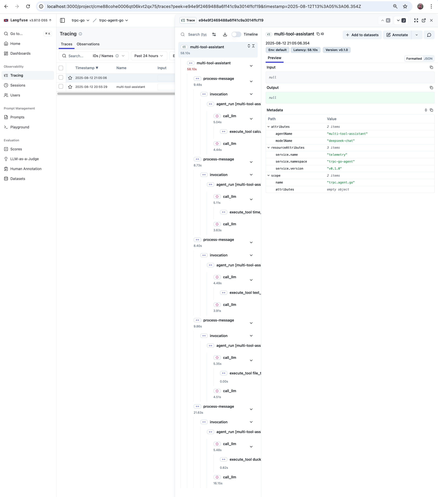

# Langfuse Collector

trpc-agent-go uses OpenTelemetry to collect traces and supports exporting trace data to Langfuse.

## Deployment Langfuse

Langfuse offers multiple deployment options. See the [official self-hosting guide](https://langfuse.com/self-hosting) for details.

For this example, you can quickly get started by [deploying Langfuse locally or on a VM using Docker Compose](https://langfuse.com/self-hosting/docker-compose).

## Configuring the Langfuse OpenTelemetry Endpoint

[Langfuse can receive traces on the `/api/public/otel` (OTLP) endpoint.](https://langfuse.com/integrations/native/opentelemetry)

### Environment Variables Configuration

If you use the OpenTelemetry SDK or Collector to export traces, you can configure the following environment variables:

```bash
# EU data region
OTEL_EXPORTER_OTLP_ENDPOINT="https://cloud.langfuse.com/api/public/otel"
# US data region
# OTEL_EXPORTER_OTLP_ENDPOINT="https://us.cloud.langfuse.com/api/public/otel"
# Local deployment (>= v3.22.0)
# OTEL_EXPORTER_OTLP_ENDPOINT="http://localhost:3000/api/public/otel"

# Set Basic Auth header
OTEL_EXPORTER_OTLP_HEADERS="Authorization=Basic ${AUTH_STRING}"
```

Langfuse uses Basic Auth for authentication.

You can generate the base64-encoded API key (AUTH_STRING) with the following command:

```bash
echo -n "pk-lf-1234567890:sk-lf-1234567890" | base64
# For long keys on GNU systems, add -w 0 to prevent line wrapping
```

If your Collector requires a signal-specific endpoint for traces, use:

```bash
OTEL_EXPORTER_OTLP_TRACES_ENDPOINT="https://cloud.langfuse.com/api/public/otel/v1/traces" # EU data region
# OTEL_EXPORTER_OTLP_TRACES_ENDPOINT="https://us.cloud.langfuse.com/api/public/otel/v1/traces" # US data region
```

> Note: Langfuse's OpenTelemetry endpoint only supports HTTP/protobuf, not gRPC.

### Example: Go Code Integration

```go
import (
	"context"
	"encoding/base64"
	"fmt"
	"log"

	atrace "trpc.group/trpc-go/trpc-agent-go/telemetry/trace"
)

func main() {
	// https://langfuse.com/integrations/native/opentelemetry
	langFuseSecretKey := getEnv("LANGFUSE_SECRET_KEY", "your-secret-key")
	langFusePublicKey := getEnv("LANGFUSE_PUBLIC_KEY", "your-public-key")
	langFuseHost := "http://localhost:3000"
	otelEndpointPath := "/api/public/otel/v1/traces"

	// Start trace
	clean, err := atrace.Start(
		context.Background(),
		atrace.WithEndpointURL(langFuseHost+otelEndpointPath),
		atrace.WithProtocol("http"),
		atrace.WithHeaders(map[string]string{
			"Authorization": fmt.Sprintf("Basic %s", encodeAuth(langFusePublicKey, langFuseSecretKey)),
		}),
	)
	if err != nil {
		log.Fatalf("Failed to start trace telemetry: %v", err)
	}
	defer func() {
		if err := clean(); err != nil {
			log.Printf("Failed to clean up metric telemetry: %v", err)
		}
	}()

func encodeAuth(pk, sk string) string {
	auth := pk + ":" + sk
	return base64.StdEncoding.EncodeToString([]byte(auth))
}
```

## Running the code

You can find the complete code for this example in the [main.go](./main.go)
file. To run it, ensure you have a somewhat recent version of Go (preferably >=
1.13) and do

```bash
go run .
```

The example simulates an intelligent agent application that processes a series of user messages, demonstrating tracing and metrics collection for multiple tool-based tasks.

## Viewing Trace data

